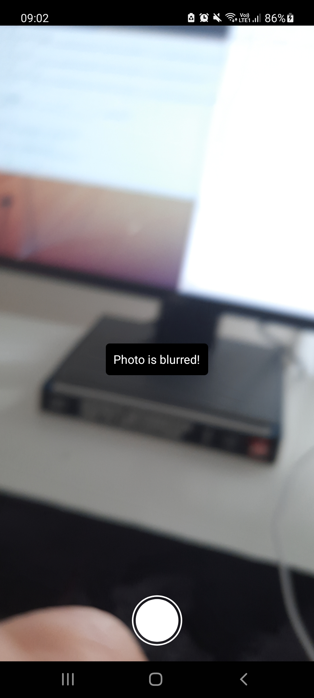

# may27-opencv-android
a working integration OpenCV - React Native with NativeModules method as of may 27, 2021. 

However be advised, this method may not be a good solution to add OpenCV library to your apps, as it will require you to write your own native module library in Java, where documantation is not updated. Also given the nature of Native Modules, you need to be aware of any possible performance issues for your app.

I hope this repo helps you with getting started happy coding!! :)

# Resources

https://stackoverflow.com/questions/59800761/how-can-i-import-opencv-library-to-react-native-project
https://brainhub.eu/library/opencv-react-native-image-processing/

